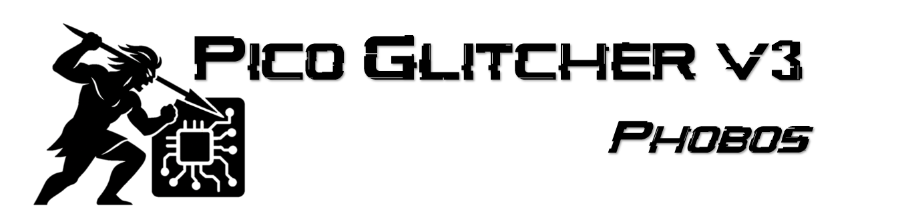
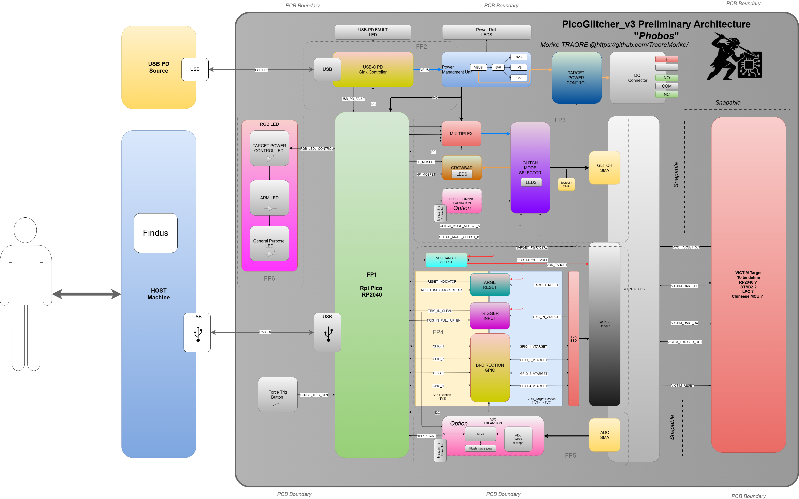

**Hardware Voltage Glitching Tool for Security Research**

---

## ⚠️ Work in Progress

> **Note**: This project is currently under active development. The hardware design, schematics, and documentation are not yet finalized. Features and specifications may change as development progresses.

**Current Status:**
- ✅ Preliminary architecture design completed
- 🔄 Schematic design in progress
- ⏳ PCB layout pending
- ⏳ Bill of materials pending
- ⏳ Testing and validation pending

---

# PicoGlitcher_v3-Phobos

This repository contains the hardware development files for PicoGlitcher v3 – Phobos, a project inspired by the original PicoGlitcher developed and maintained by Matthias Kessenheimer (see https://github.com/MKesenheimer/fault-injection-library).

# Goal

The PicoGlitcher v3 – Phobos improves on the hardware capabilities of the PicoGlitcher v2.x by adding features such as USB-C Power Delivery, an add-on ADC for side-channel analysis, a flexible target voltage reference, and more. It continues to use the RP2040 as the main microcontroller to minimize changes required in the Findus tool suite.

The design is driven by a low bill of materials (to be affordable to all), modularity for future evolution, and minimal dependencies on the RP2040.

# Name

The project uses the codename "Phobos", inspired by the Greek god Phobos, the personification of fear. The name reflects the device's purpose to induce instability and disrupt normal system operation, much like Phobos brought panic and chaos to the battlefield.

# Architecture

* 1x Micro USB Connector for host communication and updates.  
* 1x USB-C Connector (without data lines).
* 1x SMA Connector for voltage glitching.
* 1x SMA Connector for side channel attack. 
* 1x 20-pin header for Phobos <-> target interactions (VDD, trigger, UART, etc.).  

## FP1 Microcontroller

* Responsible for handling voltage glitching campaigns among 3 user-selected modes: multiplex, crowbar, and pulse shaping.
* Multiplex with low impedance the correct glitching circuitry on the glitch SMA connector.  
* Control USB-C Power delivery sink controller through I2C.
* Control ON/OFF delivery of USB-C power source to the target (e.g., +12VDC automotive ECU).  
* Sense the target voltage reference to automatically set the appropriate GPIO level.  
* Handle trigger input mode (Schmitt high-Z buffer, open-drain/dry contact).
* Configure 4x GPIO (Output, Input). 
* Handle communication with ADC add-on daughter board.  
* Control LEDs to provide user information/states. 

## FP2 USB-C Power Delivery and Power Management Unit (PMU)

* State-of-the-art USB sink source Infineon CYPD3177.
* +5VDC to 20VDC 3A power delivery.
* Built-in fault mode.
* +5VDC step down.
* Reverse polarity protection (optionally current too?).  
* Generation of +3V3, +1V8, +1V2 600mA power rails.  

## FP3 Glitching Circuitry
* 5-bit resolution multiplex voltage glitching with >10ns switching (theoretically). 
    * 4-level voltage user configurable (0V8 - 5V).
    * 1 level to GND (low power crowbar MOSFET).
* Low and high power crowbar glitching MOSFET with analog LEDs.  
* Pulse shaping glitching (add-on daughter board). 

## FP4 Target GPIOs
* Target voltage reference.
* Control ON/OFF target power with low-cost BDS.
* Trigger input circuitry for glitching and ADC capture.  
* Bi-directional GPIO (4x SN74LVC1T45).

## FP5 ADC
* ADC add-on daughter board (it's too much for the current RP2040 to handle a high sample rate ADC). 
* SPI/Protobuf to gather samples from daughter board.  

## FP6 LEDs
* 1x LED to indicate the state of target power.  
* 1x LED to highlight arming status.  
* 1x general-purpose LED. 

# Roadmap 
- [x] Preliminary architecture
- [x] Preliminary schematic (in progress...)
- [ ] Preliminary bill of materials
